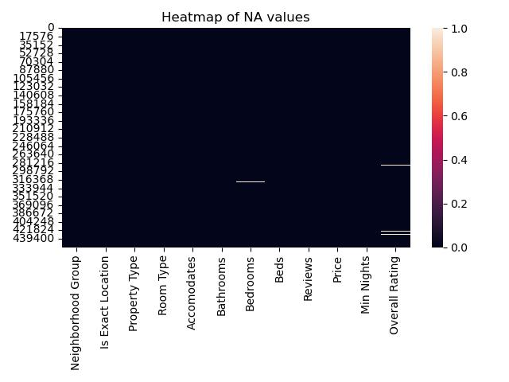
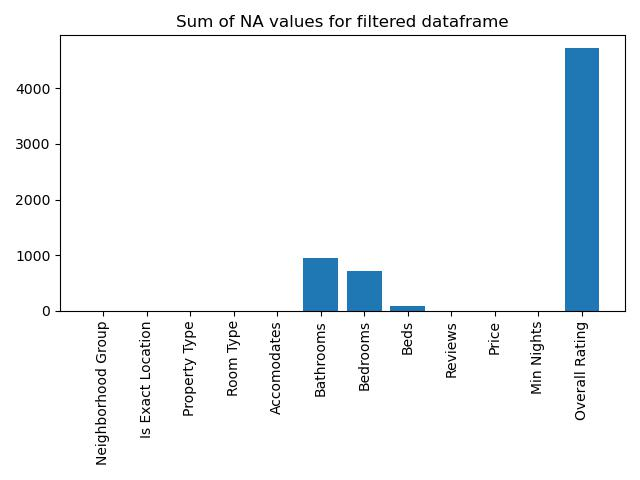
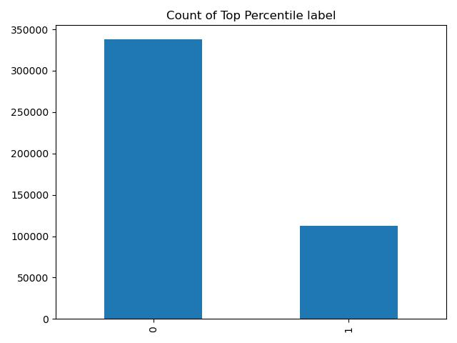

# Identifying Berlin AIRBNBs likely to get top 5% ratings

## Authors

Nikolas Margos   
https://github.com/NMARGOS   
https://www.linkedin.com/in/nikolasmargos/   

## Business value /usage in real life
Immediately filter out highly desired listings for further exploration and analysis either to invest in such listings or duplicate high performing characteristics.

## Description
Main goal was to create a diagnostic model that is capable of identifying listings that will receive an overall rating of >=95%.

The file contains the raw code used to test several algorithms, before settling with KNN.

## Getting Started

### Dependencies

There is enviroment_listings.yml in the repo with all the necessary dependencies.

### Workflow

A) Explore the data set to view distribution characteristics such as the count of NA values for selected columns

   
  Sample display of image in HTML format 

        
    

   
  Sample display of image in HTML format 

  
        
B) Create a normalized weight score from the columns Reviews and Overall Rating by multiplying them
        
C) Explore the distribution of Normalized Weight Score and identify the mean rating for the top quartile
      
D) Create a decision boundary based on the normalized weight score top quartile, and view the size of each label
      

   
  Sample display of image in HTML format 

   
        
Test performance using logistic regression , GaussianNB, KNeighborsClassifier & grid search and itterate over number of neighbors to find best performing combination.

## Model choice

A binary classification model was applied where the label 1 meant the property will receive a rating of >=95%

## Metric to track

Recall was the chosen metric to minimize erroneously labeling desired properties (>=95%) as <95%

## Final Model Choice and Output

KNeighborsClassifier with number of neighbors =19 achieving a recall of 0.96

